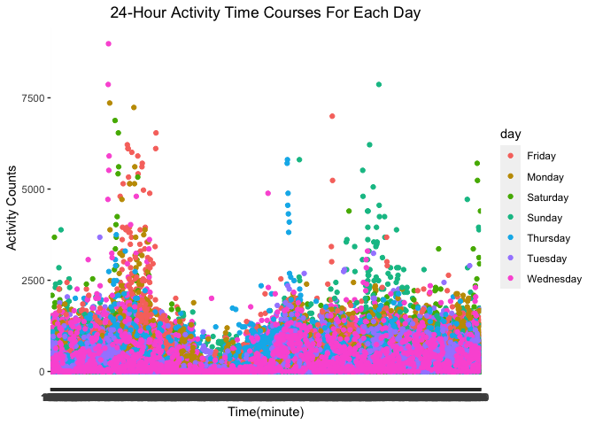

p8105_hw3_zc2610
================
Zuoqiao Cui
2022-10-07

``` r
library(tidyverse)
```

    ## ── Attaching packages ─────────────────────────────────────── tidyverse 1.3.2 ──
    ## ✔ ggplot2 3.3.6      ✔ purrr   0.3.4 
    ## ✔ tibble  3.1.8      ✔ dplyr   1.0.10
    ## ✔ tidyr   1.2.0      ✔ stringr 1.4.1 
    ## ✔ readr   2.1.2      ✔ forcats 0.5.2 
    ## ── Conflicts ────────────────────────────────────────── tidyverse_conflicts() ──
    ## ✖ dplyr::filter() masks stats::filter()
    ## ✖ dplyr::lag()    masks stats::lag()

## Problem 2

Import data

``` r
acc_df = read.csv("./data/accel_data.csv") %>% 
  janitor::clean_names()
```

combine all activity columns

``` r
acc_df = acc_df %>% 
  pivot_longer(
    activity_1:activity_1440,
    names_to = "activity_minute",
    values_to = "counts",
    names_prefix = "activity_"
  )
```

create a weekday vs weekend variable

``` r
acc_df = acc_df %>% 
  mutate(
    weekday_or_weekend = case_when(
      day == "Monday" ~ "weekday",
      day == "Tuesday" ~ "weekday",
      day == "Wednesday" ~ "weekday",
      day == "Thursday" ~ "weekday",
      day == "Friday" ~ "weekday",
      day == "Saturday" ~ "weekend",
      day == "Sunday" ~ "weekend",
      TRUE     ~ ""
    )
  ) 
```

``` r
colnames(acc_df)
```

    ## [1] "week"               "day_id"             "day"               
    ## [4] "activity_minute"    "counts"             "weekday_or_weekend"

``` r
nrow(acc_df)
```

    ## [1] 50400

``` r
ncol(acc_df)
```

    ## [1] 6

Description

1.  The resulting dataset contains following variables: week, day_id,
    day, activity_minute, counts, weekday_or_weekend

2.  There are totally 50400 observations and 6 variables in the
    resulting dataset

create a variable that sums up counts of activities in each day and show
in a table

``` r
acc_df %>% 
  group_by(week,day_id,day) %>% 
  summarise(
    total_activity = sum(`counts`)
  ) %>% 
  knitr::kable(digits = 1)
```

    ## `summarise()` has grouped output by 'week', 'day_id'. You can override using
    ## the `.groups` argument.

| week | day_id | day       | total_activity |
|-----:|-------:|:----------|---------------:|
|    1 |      1 | Friday    |       480542.6 |
|    1 |      2 | Monday    |        78828.1 |
|    1 |      3 | Saturday  |       376254.0 |
|    1 |      4 | Sunday    |       631105.0 |
|    1 |      5 | Thursday  |       355923.6 |
|    1 |      6 | Tuesday   |       307094.2 |
|    1 |      7 | Wednesday |       340115.0 |
|    2 |      8 | Friday    |       568839.0 |
|    2 |      9 | Monday    |       295431.0 |
|    2 |     10 | Saturday  |       607175.0 |
|    2 |     11 | Sunday    |       422018.0 |
|    2 |     12 | Thursday  |       474048.0 |
|    2 |     13 | Tuesday   |       423245.0 |
|    2 |     14 | Wednesday |       440962.0 |
|    3 |     15 | Friday    |       467420.0 |
|    3 |     16 | Monday    |       685910.0 |
|    3 |     17 | Saturday  |       382928.0 |
|    3 |     18 | Sunday    |       467052.0 |
|    3 |     19 | Thursday  |       371230.0 |
|    3 |     20 | Tuesday   |       381507.0 |
|    3 |     21 | Wednesday |       468869.0 |
|    4 |     22 | Friday    |       154049.0 |
|    4 |     23 | Monday    |       409450.0 |
|    4 |     24 | Saturday  |         1440.0 |
|    4 |     25 | Sunday    |       260617.0 |
|    4 |     26 | Thursday  |       340291.0 |
|    4 |     27 | Tuesday   |       319568.0 |
|    4 |     28 | Wednesday |       434460.0 |
|    5 |     29 | Friday    |       620860.0 |
|    5 |     30 | Monday    |       389080.0 |
|    5 |     31 | Saturday  |         1440.0 |
|    5 |     32 | Sunday    |       138421.0 |
|    5 |     33 | Thursday  |       549658.0 |
|    5 |     34 | Tuesday   |       367824.0 |
|    5 |     35 | Wednesday |       445366.0 |

single panel plot that shows the 24-hour activity time courses for each
day

``` r
acc_df %>% 
   ggplot(aes(x = activity_minute,y = counts,color = day)) +
   geom_point() +
   labs(
    title = "24-Hour Activity Time Courses For Each Day",
    x = "Time(minute)",
    y = "Activity Counts"
  )
```

<!-- -->

## Problem 3

load data

``` r
library(p8105.datasets)
data("ny_noaa")
```

separate date into year, month, day

``` r
ny_noaa = ny_noaa %>% 
  janitor::clean_names() %>% 
    separate(date,into = c("year","month","day"),sep = "-")
ny_noaa
```

    ## # A tibble: 2,595,176 × 9
    ##    id          year  month day    prcp  snow  snwd tmax  tmin 
    ##    <chr>       <chr> <chr> <chr> <int> <int> <int> <chr> <chr>
    ##  1 US1NYAB0001 2007  11    01       NA    NA    NA <NA>  <NA> 
    ##  2 US1NYAB0001 2007  11    02       NA    NA    NA <NA>  <NA> 
    ##  3 US1NYAB0001 2007  11    03       NA    NA    NA <NA>  <NA> 
    ##  4 US1NYAB0001 2007  11    04       NA    NA    NA <NA>  <NA> 
    ##  5 US1NYAB0001 2007  11    05       NA    NA    NA <NA>  <NA> 
    ##  6 US1NYAB0001 2007  11    06       NA    NA    NA <NA>  <NA> 
    ##  7 US1NYAB0001 2007  11    07       NA    NA    NA <NA>  <NA> 
    ##  8 US1NYAB0001 2007  11    08       NA    NA    NA <NA>  <NA> 
    ##  9 US1NYAB0001 2007  11    09       NA    NA    NA <NA>  <NA> 
    ## 10 US1NYAB0001 2007  11    10       NA    NA    NA <NA>  <NA> 
    ## # … with 2,595,166 more rows
