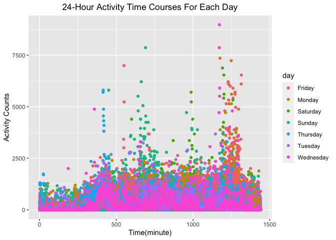
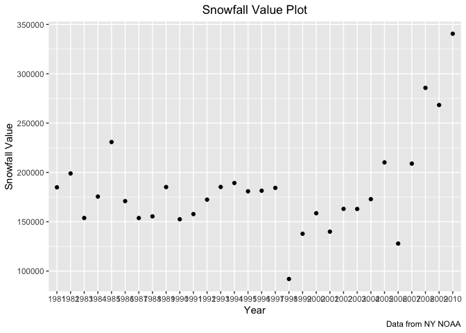
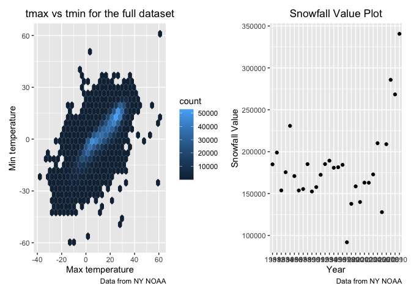

p8105_hw3_zc2610
================
Zuoqiao Cui
2022-10-07

``` r
library(tidyverse)
```

    ## ── Attaching packages ─────────────────────────────────────── tidyverse 1.3.2 ──
    ## ✔ ggplot2 3.3.6      ✔ purrr   0.3.4 
    ## ✔ tibble  3.1.8      ✔ dplyr   1.0.10
    ## ✔ tidyr   1.2.0      ✔ stringr 1.4.1 
    ## ✔ readr   2.1.2      ✔ forcats 0.5.2 
    ## ── Conflicts ────────────────────────────────────────── tidyverse_conflicts() ──
    ## ✖ dplyr::filter() masks stats::filter()
    ## ✖ dplyr::lag()    masks stats::lag()

``` r
library(ggplot2)
library(patchwork)
```

## Problem 1

``` r
library(p8105.datasets)
data("instacart")
```

1.  Count the number of aisle and order the number from large to small

2.  Make a plot showing the number of items ordered in each aisle,
    limiting this to aisles with more than 10000 items ordered.

``` r
aisle_df = instacart %>% 
  count(aisle) %>% 
  arrange(desc(n)) %>% 
  filter(n > 10000) %>% 
  mutate(aisle = fct_reorder(aisle, n)) %>% 
  #order te aisle according to the number of items ordered in each aisle
  ggplot(aes(x = aisle,y = n)) +
  geom_point() +
  labs(
    title = "Number of items ordered in each aisle (>10000)",
     x = "Aisle",
     y = "The number of items",
    caption = "Data from instacart"
  ) +
  theme(axis.text.x = element_text(angle = 60, hjust = 1),plot.title = element_text(hjust = 0.5)) 
  #better show the name of each aisle
aisle_df
```

<!-- -->
Answer:

1.There are aisles

2.Fresh vegetables are the most items ordered from

## Problem 2

Import data

``` r
acc_df = read.csv("./data/accel_data.csv") %>% 
  janitor::clean_names()
```

Combine all activity columns

``` r
acc_df = acc_df %>% 
  pivot_longer(
    activity_1:activity_1440,
    names_to = "activity_minute",
    values_to = "counts",
    names_prefix = "activity_",
  ) %>% 
  mutate(
    activity_minute = as.integer(activity_minute)
  )
acc_df
```

    ## # A tibble: 50,400 × 5
    ##     week day_id day    activity_minute counts
    ##    <int>  <int> <chr>            <int>  <dbl>
    ##  1     1      1 Friday               1   88.4
    ##  2     1      1 Friday               2   82.2
    ##  3     1      1 Friday               3   64.4
    ##  4     1      1 Friday               4   70.0
    ##  5     1      1 Friday               5   75.0
    ##  6     1      1 Friday               6   66.3
    ##  7     1      1 Friday               7   53.8
    ##  8     1      1 Friday               8   47.8
    ##  9     1      1 Friday               9   55.5
    ## 10     1      1 Friday              10   43.0
    ## # … with 50,390 more rows

Create a weekday vs weekend variable

``` r
acc_df = acc_df %>% 
  mutate(
    weekday_or_weekend = case_when(
      day == "Monday" ~ "weekday",
      day == "Tuesday" ~ "weekday",
      day == "Wednesday" ~ "weekday",
      day == "Thursday" ~ "weekday",
      day == "Friday" ~ "weekday",
      day == "Saturday" ~ "weekend",
      day == "Sunday" ~ "weekend",
      TRUE     ~ ""
    )
  ) 
```

``` r
colnames(acc_df)
```

    ## [1] "week"               "day_id"             "day"               
    ## [4] "activity_minute"    "counts"             "weekday_or_weekend"

``` r
nrow(acc_df)
```

    ## [1] 50400

``` r
ncol(acc_df)
```

    ## [1] 6

Description

1.  The resulting dataset contains following variables: week, day_id,
    day, activity_minute, counts, weekday_or_weekend

2.  There are totally 50400 observations and 6 variables in the
    resulting dataset

create a variable that sums up counts of activities in each day and show
in a table

``` r
acc_df %>% 
  group_by(week,day_id,day) %>% 
  summarise(
    total_activity = sum(`counts`)
  ) %>% 
  knitr::kable(digits = 1)
```

    ## `summarise()` has grouped output by 'week', 'day_id'. You can override using
    ## the `.groups` argument.

| week | day_id | day       | total_activity |
|-----:|-------:|:----------|---------------:|
|    1 |      1 | Friday    |       480542.6 |
|    1 |      2 | Monday    |        78828.1 |
|    1 |      3 | Saturday  |       376254.0 |
|    1 |      4 | Sunday    |       631105.0 |
|    1 |      5 | Thursday  |       355923.6 |
|    1 |      6 | Tuesday   |       307094.2 |
|    1 |      7 | Wednesday |       340115.0 |
|    2 |      8 | Friday    |       568839.0 |
|    2 |      9 | Monday    |       295431.0 |
|    2 |     10 | Saturday  |       607175.0 |
|    2 |     11 | Sunday    |       422018.0 |
|    2 |     12 | Thursday  |       474048.0 |
|    2 |     13 | Tuesday   |       423245.0 |
|    2 |     14 | Wednesday |       440962.0 |
|    3 |     15 | Friday    |       467420.0 |
|    3 |     16 | Monday    |       685910.0 |
|    3 |     17 | Saturday  |       382928.0 |
|    3 |     18 | Sunday    |       467052.0 |
|    3 |     19 | Thursday  |       371230.0 |
|    3 |     20 | Tuesday   |       381507.0 |
|    3 |     21 | Wednesday |       468869.0 |
|    4 |     22 | Friday    |       154049.0 |
|    4 |     23 | Monday    |       409450.0 |
|    4 |     24 | Saturday  |         1440.0 |
|    4 |     25 | Sunday    |       260617.0 |
|    4 |     26 | Thursday  |       340291.0 |
|    4 |     27 | Tuesday   |       319568.0 |
|    4 |     28 | Wednesday |       434460.0 |
|    5 |     29 | Friday    |       620860.0 |
|    5 |     30 | Monday    |       389080.0 |
|    5 |     31 | Saturday  |         1440.0 |
|    5 |     32 | Sunday    |       138421.0 |
|    5 |     33 | Thursday  |       549658.0 |
|    5 |     34 | Tuesday   |       367824.0 |
|    5 |     35 | Wednesday |       445366.0 |

Single panel plot that shows the 24-hour activity time courses for each
day

``` r
acc_df %>% 
   ggplot(aes(x = activity_minute,y = counts,color = day)) +
   geom_point() +
   labs(
    title = "24-Hour Activity Time Courses For Each Day",
    x = "Time(minute)",
    y = "Activity Counts"
  ) +
   theme(plot.title = element_text(hjust = 0.5))
```

<!-- -->

``` r
acc_df
```

    ## # A tibble: 50,400 × 6
    ##     week day_id day    activity_minute counts weekday_or_weekend
    ##    <int>  <int> <chr>            <int>  <dbl> <chr>             
    ##  1     1      1 Friday               1   88.4 weekday           
    ##  2     1      1 Friday               2   82.2 weekday           
    ##  3     1      1 Friday               3   64.4 weekday           
    ##  4     1      1 Friday               4   70.0 weekday           
    ##  5     1      1 Friday               5   75.0 weekday           
    ##  6     1      1 Friday               6   66.3 weekday           
    ##  7     1      1 Friday               7   53.8 weekday           
    ##  8     1      1 Friday               8   47.8 weekday           
    ##  9     1      1 Friday               9   55.5 weekday           
    ## 10     1      1 Friday              10   43.0 weekday           
    ## # … with 50,390 more rows

## Problem 3

Load data

``` r
library(p8105.datasets)
data("ny_noaa")
```

Tidy data 1.Separate date into year, month, day

``` r
ny_noaa = ny_noaa %>% 
  janitor::clean_names() %>% 
    separate(date,into = c("year","month","day"),sep = "-")
```

2.  To ensure observations for temperature, precipitation, and snowfall
    are given in reasonable units since the observation for
    precipitation uses tenths of mm as its unit, we can change it to mm
    unit. The unit of temperature also needs to be changed from tenths
    of degrees to degrees

``` r
ny_noaa = ny_noaa %>% 
  mutate(
    prcp = prcp/10,
    tmax = as.numeric(tmax)/10,
    tmin = as.numeric(tmin)/10
  )
ny_noaa
```

    ## # A tibble: 2,595,176 × 9
    ##    id          year  month day    prcp  snow  snwd  tmax  tmin
    ##    <chr>       <chr> <chr> <chr> <dbl> <int> <int> <dbl> <dbl>
    ##  1 US1NYAB0001 2007  11    01       NA    NA    NA    NA    NA
    ##  2 US1NYAB0001 2007  11    02       NA    NA    NA    NA    NA
    ##  3 US1NYAB0001 2007  11    03       NA    NA    NA    NA    NA
    ##  4 US1NYAB0001 2007  11    04       NA    NA    NA    NA    NA
    ##  5 US1NYAB0001 2007  11    05       NA    NA    NA    NA    NA
    ##  6 US1NYAB0001 2007  11    06       NA    NA    NA    NA    NA
    ##  7 US1NYAB0001 2007  11    07       NA    NA    NA    NA    NA
    ##  8 US1NYAB0001 2007  11    08       NA    NA    NA    NA    NA
    ##  9 US1NYAB0001 2007  11    09       NA    NA    NA    NA    NA
    ## 10 US1NYAB0001 2007  11    10       NA    NA    NA    NA    NA
    ## # … with 2,595,166 more rows

3.  Find the most commonly observed values for snowfall

``` r
total_num_of_snowfall = (nrow(ny_noaa))
num_of_na_snowfall = sum(is.na(ny_noaa$snow))
percentage_of_na = num_of_na_snowfall/total_num_of_snowfall
num_of_zero_snowfall = nrow(filter(ny_noaa,snow == 0))
percentage_of_zero = num_of_zero_snowfall/total_num_of_snowfall
```

Answer:

The percentage of NA value in snowfall column is 0.146896 and the
percentage of 0 value in snowfall column is 0.773939.

Since the percentage of 0 value in snowfall column is 0.773939 \> 0.5,
which means more than half of the value for snowfall is 0. Therefore,
the most commonly observed values for snowfall is 0.

Change month number to month name

``` r
ny_noaa = ny_noaa %>% 
  mutate(
     month = recode(month, "01" = "January",
                  "02" = "February",
                  "03" = "March",
                  "04" = "April",
                  "05" = "May",
                  "06" = "June",
                  "07" = "July",
                  "08" = "Augest",
                  "09" = "September",
                  "10" = "October",
                  "11" = "November", 
                  "12" = "December"
                  )
     )
```

Make a two-panel plot show the average max temperature in January and
July

``` r
ny_noaa %>% 
  group_by(id,year,month) %>% 
  filter(month == "January" | month == "July") %>% 
  summarize(
    mean_tmax = mean(tmax,na.rm = TRUE)
  ) %>% 
  ggplot(aes(x = year,y = mean_tmax,color = month)) +
  geom_point() +
 labs(
    title = "Average Max Temperature Plot (January vs July)",
    x = "Year",
    y = "Average Max Temperature",
    caption = "Data from NY NOAA"
  ) +
   theme(plot.title = element_text(hjust = 0.5)) +
  facet_grid(~month)
```

    ## `summarise()` has grouped output by 'id', 'year'. You can override using the
    ## `.groups` argument.

    ## Warning: Removed 5970 rows containing missing values (geom_point).

<!-- -->
(i) Make a plot show tmax vs tmin

``` r
tmax_tmin_df = ny_noaa %>% 
ggplot(aes(x = tmin, y = tmax)) + 
  geom_hex() +
  labs(
    x = "Min temperature",
    y = "Max temperature", 
    title = "tmax vs tmin for the full dataset",
    caption = "Data from NY NOAA"
    ) +
   theme(plot.title = element_text(hjust = 0.5)) 
tmax_tmin_df
```

    ## Warning: Removed 1136276 rows containing non-finite values (stat_binhex).

<!-- -->

2)  Make a plot show the distribution of snowfall values greater than 0
    and less than 100 separated by year

``` r
snowfall_df = ny_noaa %>% 
  mutate(
    year = factor(year)
  ) %>% 
  filter(snow > 0 & snow < 100) %>% 
  ggplot(aes(x = year, y = snow)) + 
  geom_boxplot() +
  labs(
    title = "Snowfall Value Plot",
    x = "Year",
    y = "Snowfall Value",
    caption = "Data from NY NOAA"
  ) +
   theme(plot.title = element_text(hjust = 0.5))
snowfall_df
```

<!-- -->

Use patchwork to combine two plots above together

``` r
tmax_tmin_df+snowfall_df
```

    ## Warning: Removed 1136276 rows containing non-finite values (stat_binhex).

<!-- -->
