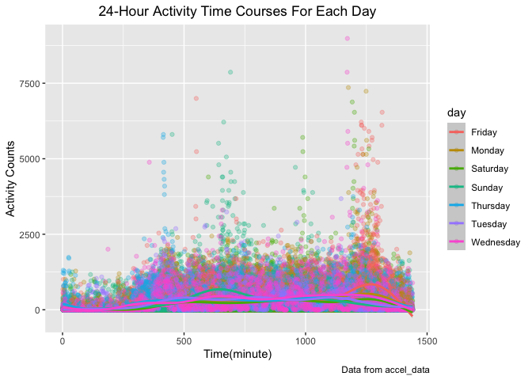

p8105_hw3_zc2610
================
Zuoqiao Cui
2022-10-07

``` r
library(tidyverse)
```

    ## ── Attaching packages ─────────────────────────────────────── tidyverse 1.3.2 ──
    ## ✔ ggplot2 3.3.6      ✔ purrr   0.3.4 
    ## ✔ tibble  3.1.8      ✔ dplyr   1.0.10
    ## ✔ tidyr   1.2.0      ✔ stringr 1.4.1 
    ## ✔ readr   2.1.2      ✔ forcats 0.5.2 
    ## ── Conflicts ────────────────────────────────────────── tidyverse_conflicts() ──
    ## ✖ dplyr::filter() masks stats::filter()
    ## ✖ dplyr::lag()    masks stats::lag()

``` r
library(ggplot2)
library(patchwork)
```

## Problem 1

``` r
library(p8105.datasets)
data("instacart")
```

1.  Count the number of aisle and order the number from large to small

2.  Make a plot showing the number of items ordered in each aisle,
    limiting this to aisles with more than 10000 items ordered.

``` r
aisle_df = instacart %>% 
  count(aisle) %>% 
  arrange(desc(n)) %>% 
  filter(n > 10000) %>% 
  mutate(aisle = fct_reorder(aisle, n)) %>% 
  #order the aisle according to the number of items ordered in each aisle
  ggplot(aes(x = aisle,y = n)) +
  geom_point() +
  labs(
    title = "Number of items ordered in each aisle (>10000)",
     x = "Aisle",
     y = "The number of items",
    caption = "Data from instacart"
  ) +
  theme(axis.text.x = element_text(angle = 60, hjust = 1),plot.title = element_text(hjust = 0.5)) 
  #better show the name of each aisle
aisle_df
```

<!-- -->
Answer:

1.There are 134 aisles

2.Fresh vegetables are the most items ordered from

Make a table showing the three most popular items in each of the aisles
“baking ingredients”, “dog food care”, and “packaged vegetables fruits”.
Include the number of times each item is ordered in your table.

``` r
instacart %>% 
  filter(aisle == "baking ingredients" | aisle == "dog food care" | aisle == "packaged vegetables fruits") %>% 
  group_by(aisle) %>% 
  count(product_name) %>% 
  # number of times to be ordered
  mutate(rank = min_rank(desc(n))) %>% 
  # order by the number of times to be ordered
  filter(rank < 4) %>% 
  arrange(desc(n)) %>% 
  knitr::kable()
```

| aisle                      | product_name                                  |    n | rank |
|:---------------------------|:----------------------------------------------|-----:|-----:|
| packaged vegetables fruits | Organic Baby Spinach                          | 9784 |    1 |
| packaged vegetables fruits | Organic Raspberries                           | 5546 |    2 |
| packaged vegetables fruits | Organic Blueberries                           | 4966 |    3 |
| baking ingredients         | Light Brown Sugar                             |  499 |    1 |
| baking ingredients         | Pure Baking Soda                              |  387 |    2 |
| baking ingredients         | Cane Sugar                                    |  336 |    3 |
| dog food care              | Snack Sticks Chicken & Rice Recipe Dog Treats |   30 |    1 |
| dog food care              | Organix Chicken & Brown Rice Recipe           |   28 |    2 |
| dog food care              | Small Dog Biscuits                            |   26 |    3 |

``` r
# find out the top 3 popular product and the number of being ordered
```

Make a table showing the mean hour of the day at which Pink Lady Apples
and Coffee Ice Cream are ordered on each day of the week; format this
table for human readers

``` r
instacart %>% 
  filter(product_name == "Pink Lady Apples" | product_name == "Coffee Ice Cream") %>% 
  group_by(product_name,order_dow) %>% 
  summarize(mean_hour = mean(order_hour_of_day)) %>% 
  spread(key = order_dow, value = mean_hour) %>% 
#change the data frame from longer to wider
  knitr::kable(digits = 1)
```

    ## `summarise()` has grouped output by 'product_name'. You can override using the
    ## `.groups` argument.

| product_name     |    0 |    1 |    2 |    3 |    4 |    5 |    6 |
|:-----------------|-----:|-----:|-----:|-----:|-----:|-----:|-----:|
| Coffee Ice Cream | 13.8 | 14.3 | 15.4 | 15.3 | 15.2 | 12.3 | 13.8 |
| Pink Lady Apples | 13.4 | 11.4 | 11.7 | 14.2 | 11.6 | 12.8 | 11.9 |

## Problem 2

Import data

``` r
acc_df = read.csv("./data/accel_data.csv") %>% 
  janitor::clean_names()
```

Combine all activity columns

``` r
acc_df = acc_df %>% 
  pivot_longer(
    activity_1:activity_1440,
    names_to = "activity_minute",
    values_to = "counts",
    names_prefix = "activity_",
  ) %>% 
  mutate(
    activity_minute = as.integer(activity_minute)
  )
```

Create a weekday vs weekend variable

``` r
acc_df = acc_df %>% 
  mutate(
    weekday_or_weekend = case_when(
      day == "Monday" ~ "weekday",
      day == "Tuesday" ~ "weekday",
      day == "Wednesday" ~ "weekday",
      day == "Thursday" ~ "weekday",
      day == "Friday" ~ "weekday",
      day == "Saturday" ~ "weekend",
      day == "Sunday" ~ "weekend",
      TRUE     ~ ""
    )
  ) 
```

``` r
colnames(acc_df)
```

    ## [1] "week"               "day_id"             "day"               
    ## [4] "activity_minute"    "counts"             "weekday_or_weekend"

``` r
nrow(acc_df)
```

    ## [1] 50400

``` r
ncol(acc_df)
```

    ## [1] 6

Description

1.  The resulting dataset contains following variables: week, day_id,
    day, activity_minute, counts, weekday_or_weekend

2.  There are totally 50400 observations and 6 variables in the
    resulting dataset

create a variable that sums up counts of activities in each day and show
in a table

``` r
acc_df %>% 
  group_by(week,day_id,day) %>% 
  summarise(
    total_activity = sum(`counts`)
  ) %>% 
  arrange(week,desc(total_activity)) %>% 
  # order the total activity counts for each week
  knitr::kable(digits = 1)
```

    ## `summarise()` has grouped output by 'week', 'day_id'. You can override using
    ## the `.groups` argument.

| week | day_id | day       | total_activity |
|-----:|-------:|:----------|---------------:|
|    1 |      4 | Sunday    |       631105.0 |
|    1 |      1 | Friday    |       480542.6 |
|    1 |      3 | Saturday  |       376254.0 |
|    1 |      5 | Thursday  |       355923.6 |
|    1 |      7 | Wednesday |       340115.0 |
|    1 |      6 | Tuesday   |       307094.2 |
|    1 |      2 | Monday    |        78828.1 |
|    2 |     10 | Saturday  |       607175.0 |
|    2 |      8 | Friday    |       568839.0 |
|    2 |     12 | Thursday  |       474048.0 |
|    2 |     14 | Wednesday |       440962.0 |
|    2 |     13 | Tuesday   |       423245.0 |
|    2 |     11 | Sunday    |       422018.0 |
|    2 |      9 | Monday    |       295431.0 |
|    3 |     16 | Monday    |       685910.0 |
|    3 |     21 | Wednesday |       468869.0 |
|    3 |     15 | Friday    |       467420.0 |
|    3 |     18 | Sunday    |       467052.0 |
|    3 |     17 | Saturday  |       382928.0 |
|    3 |     20 | Tuesday   |       381507.0 |
|    3 |     19 | Thursday  |       371230.0 |
|    4 |     28 | Wednesday |       434460.0 |
|    4 |     23 | Monday    |       409450.0 |
|    4 |     26 | Thursday  |       340291.0 |
|    4 |     27 | Tuesday   |       319568.0 |
|    4 |     25 | Sunday    |       260617.0 |
|    4 |     22 | Friday    |       154049.0 |
|    4 |     24 | Saturday  |         1440.0 |
|    5 |     29 | Friday    |       620860.0 |
|    5 |     33 | Thursday  |       549658.0 |
|    5 |     35 | Wednesday |       445366.0 |
|    5 |     30 | Monday    |       389080.0 |
|    5 |     34 | Tuesday   |       367824.0 |
|    5 |     32 | Sunday    |       138421.0 |
|    5 |     31 | Saturday  |         1440.0 |

Answer:

1.  For week 1, the highest total activity counts appear on Sunday. For
    week 2,the highest total activity counts appear on Saturday. For
    week 3,the highest total activity counts appear on Monday.For week
    4,the highest total activity counts appear on Wednesday. For week
    5,the highest total activity counts appear on Friday.Therefore, from
    the perspective of the highest total activity counts, there is no
    apparent trend to follow.
2.  The order of total activity counts for the 1st week is Friday \>
    Thursday \> Wednesday \> Monday \> Tuesday \> Sunday \> Saturday.
    The order of total activity counts for the 2nd week is Wednesday \>
    Monday \> Thursday \> Tuesday \> Sunday \> Friday \> Saturday. The
    order of total activity counts for the 3rd week is Monday \>
    Wednesday \> Friday \> Sunday \> Saturday \> Tuesday \> Thursday.The
    order of total activity counts for the 4th week is Saturday \>
    Friday \> Thursday \> Wednesday \> Tuesday \> Sunday \> Monday.The
    order of total activity counts for the 5th week is Sunday \> Friday
    \> Saturday \> Thursday \> Wednesday \> Tuesday \> Monday. There is
    still no apparent trend for order.
3.  There are some abnormal data on week 1 Monday, week 4 and week 5
    Monday since the total activity counts are too low compared to other
    days.

Single panel plot that shows the 24-hour activity time courses for each
day

``` r
acc_df %>% 
   ggplot(aes(x = activity_minute,y = counts,color = day)) +
   geom_point() +
   labs(
    title = "24-Hour Activity Time Courses For Each Day",
    x = "Time(minute)",
    y = "Activity Counts",
    caption = "Data from accel_data"
  ) +
   theme(plot.title = element_text(hjust = 0.5))
```

<!-- -->

``` r
# put the title in the center
acc_df
```

    ## # A tibble: 50,400 × 6
    ##     week day_id day    activity_minute counts weekday_or_weekend
    ##    <int>  <int> <chr>            <int>  <dbl> <chr>             
    ##  1     1      1 Friday               1   88.4 weekday           
    ##  2     1      1 Friday               2   82.2 weekday           
    ##  3     1      1 Friday               3   64.4 weekday           
    ##  4     1      1 Friday               4   70.0 weekday           
    ##  5     1      1 Friday               5   75.0 weekday           
    ##  6     1      1 Friday               6   66.3 weekday           
    ##  7     1      1 Friday               7   53.8 weekday           
    ##  8     1      1 Friday               8   47.8 weekday           
    ##  9     1      1 Friday               9   55.5 weekday           
    ## 10     1      1 Friday              10   43.0 weekday           
    ## # … with 50,390 more rows

Answer:

1.  Tuesday,Wednesday and Friday have lower activity counts compared to
    other days, which means these three days have more stable activity
    counts. (especially Wednesday)
2.  Compared to other minutes, activity counts are higher at around the
    1250th minute, which means everyday at around 8 pm, more activity
    counts are made.

## Problem 3

Load data

``` r
library(p8105.datasets)
data("ny_noaa")
```

Tidy data 1.Separate date into year, month, day

``` r
ny_noaa = ny_noaa %>% 
  janitor::clean_names() %>% 
    separate(date,into = c("year","month","day"),sep = "-")
```

2.  To ensure observations for temperature, precipitation, and snowfall
    are given in reasonable units since the observation for
    precipitation uses tenths of mm as its unit, we can change it to mm
    unit. The unit of temperature also needs to be changed from tenths
    of degrees C to degrees C

``` r
ny_noaa = ny_noaa %>% 
  mutate(
    prcp = prcp/10,
    # change the unit of precipitation from tenths of mm to mm for later calculation
    tmax = as.numeric(tmax)/10,
    tmin = as.numeric(tmin)/10
    # change the unit of minimum and maximum temperature from tenths of degrees C to degrees C for later calculation
  )
ny_noaa
```

    ## # A tibble: 2,595,176 × 9
    ##    id          year  month day    prcp  snow  snwd  tmax  tmin
    ##    <chr>       <chr> <chr> <chr> <dbl> <int> <int> <dbl> <dbl>
    ##  1 US1NYAB0001 2007  11    01       NA    NA    NA    NA    NA
    ##  2 US1NYAB0001 2007  11    02       NA    NA    NA    NA    NA
    ##  3 US1NYAB0001 2007  11    03       NA    NA    NA    NA    NA
    ##  4 US1NYAB0001 2007  11    04       NA    NA    NA    NA    NA
    ##  5 US1NYAB0001 2007  11    05       NA    NA    NA    NA    NA
    ##  6 US1NYAB0001 2007  11    06       NA    NA    NA    NA    NA
    ##  7 US1NYAB0001 2007  11    07       NA    NA    NA    NA    NA
    ##  8 US1NYAB0001 2007  11    08       NA    NA    NA    NA    NA
    ##  9 US1NYAB0001 2007  11    09       NA    NA    NA    NA    NA
    ## 10 US1NYAB0001 2007  11    10       NA    NA    NA    NA    NA
    ## # … with 2,595,166 more rows

3.  Find the most commonly observed values for snowfall

``` r
total_num_of_snowfall = (nrow(ny_noaa))
num_of_na_snowfall = sum(is.na(ny_noaa$snow))
# calculate the number of NA in snow column
percentage_of_na = num_of_na_snowfall/total_num_of_snowfall
num_of_zero_snowfall = nrow(filter(ny_noaa,snow == 0))
percentage_of_zero = num_of_zero_snowfall/total_num_of_snowfall
```

Answer:

The percentage of NA value in snowfall column is 0.146896 and the
percentage of 0 value in snowfall column is 0.773939.

Since the percentage of 0 value in snowfall column is 0.773939 \> 0.5,
which means more than half of the value for snowfall is 0. Therefore,
the most commonly observed values for snowfall is 0.

Change month number to month name

``` r
ny_noaa = ny_noaa %>% 
  mutate(
     month = recode(month, "01" = "January",
                  "02" = "February",
                  "03" = "March",
                  "04" = "April",
                  "05" = "May",
                  "06" = "June",
                  "07" = "July",
                  "08" = "Augest",
                  "09" = "September",
                  "10" = "October",
                  "11" = "November", 
                  "12" = "December"
                  )
     )
```

Make a two-panel plot show the average max temperature in January and
July

``` r
ny_noaa %>% 
  group_by(id,year,month) %>% 
  filter(month == "January" | month == "July") %>% 
  summarize(
    mean_tmax = mean(tmax,na.rm = TRUE)
  ) %>% 
  ggplot(aes(x = year,y = mean_tmax,color = month)) +
  geom_point() +
 labs(
    title = "Average Max Temperature Plot (January vs July)",
    x = "Year",
    y = "Average Max Temperature",
    caption = "Data from NY NOAA"
  ) +
   theme(plot.title = element_text(hjust = 0.5)) +
  facet_grid(~month) 
```

    ## `summarise()` has grouped output by 'id', 'year'. You can override using the
    ## `.groups` argument.

    ## Warning: Removed 5970 rows containing missing values (geom_point).

<!-- -->

``` r
# separate this panel into two panel plot by January and July
```

Answer:

1.  For January, the average tmax is increasing according to the total
    trend between year 1980 an 1990. There is an obvious decreasing in
    around 1994. Then the average tmax decreased a lot between 2003
    and 2004. Then tmax increased a lot in 2006. Then it kept
    decreasing. For July, there are fewer varies compared to January.
    The average tmax is stable in total. In around 1986, 1992,2000 and
    2009, the average tmax has an obvious decreasing and there is an
    obvious increasing in 2010.
2.  For the panel, we can see that both January and July have several
    outliers. For instance, between 1980 and 1985, there is an obvious
    outlier of tmax in January and one of the 2005 year’s average tmaxs
    is also an outlier. As for July, between 1985 and 1990, there is
    also an outlier of tmax.

<!-- -->

1)  Make a plot show tmax vs tmin (tmax should be the vertical axis and
    tmin should be the horizontal axis)

``` r
tmax_tmin_df = ny_noaa %>% 
ggplot(aes(x = tmin, y = tmax)) + 
  geom_hex() +
  labs(
    x = "Min temperature",
    y = "Max temperature", 
    title = "tmax vs tmin for the full dataset",
    caption = "Data from NY NOAA"
    ) +
   theme(plot.title = element_text(hjust = 0.5)) 
tmax_tmin_df
```

    ## Warning: Removed 1136276 rows containing non-finite values (stat_binhex).

<!-- -->

2)  Make a plot show the distribution of snowfall values greater than 0
    and less than 100 separated by year

For distribution, we always use density but in this problem, we need to
show the distribution for each year. Therefore, I think it is better to
choose boxplot so that distributions can be separated by each year and
it is also helpful for me to find out the outliers in each year

``` r
snowfall_df = ny_noaa %>% 
  mutate(
    year = factor(year)
  ) %>% 
  filter(snow > 0 & snow < 100) %>% 
  ggplot(aes(x = year, y = snow)) + 
  geom_boxplot() +
  labs(
    title = "Snowfall Value Plot",
    x = "Year",
    y = "Snowfall Value",
    caption = "Data from NY NOAA"
  ) +
   theme(plot.title = element_text(hjust = 0.5))
snowfall_df
```

<!-- -->

Use patchwork to combine two plots above together

``` r
tmax_tmin_df + snowfall_df
```

    ## Warning: Removed 1136276 rows containing non-finite values (stat_binhex).

<!-- -->
